# MM-CD

**MM-CD: MultiModal Craniocerebral Diagnose based on  3D CT and Image Reports**

## Model Architecture


<center>Architecture of our MM-CD model.</center>


<center>Architecture of our weight generator model.</center>


<center>Architecture of our image fusion model.</center>

## Case Study Analyze

- The top 5 outputs from the weight generation module: Each row represents the five slices with the highest abnormal weight values from a single output of the weight generation module. Anchor boxes within each slice indicate lesions annotated by professional physicians.

|                         |                       **CT Slice1**                       |             **CT Slice2**              |                 **CT Slice3**                 |             **CT Slice4**              |                       **CT Slice5**                       |
| :---------------------: | :-------------------------------------------------------: | :------------------------------------: | :-------------------------------------------: | :------------------------------------: | :-------------------------------------------------------: |
| **Patient1's CT Slice** |          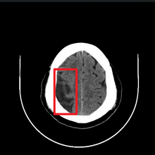           | 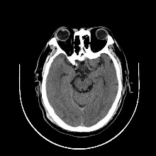 |    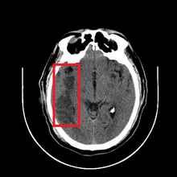     | 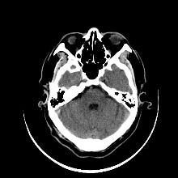 |          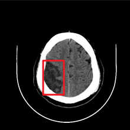           |
| **Patient1's Diganose** |       infarction lesion; <br />cerebral hemisphere        |                  None                  | infarction lesion; <br />cerebral hemisphere  |                  None                  |       infarction lesion; <br />cerebral hemisphere        |
| **Patient2's CT Slice** |          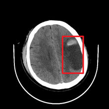           | 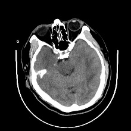 |    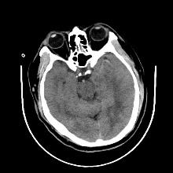     | 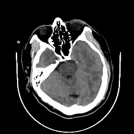 |          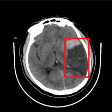           |
| **Patient2's Diganose** | infarction lesion; <br />contrast agent; <br />fptoi lobe |                  None                  |                     None                      |                  None                  | infarction lesion; <br />contrast agent; <br />fptoi lobe |
| **Patient3's CT Slice** |          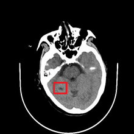           | 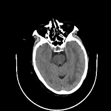 |    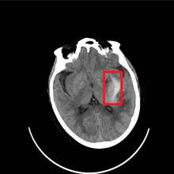     | 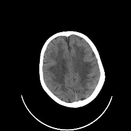 |          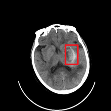           |
| **Patient3's Diganose** |   lacunar infarction lesion; <br />cerebral hemisphere    |                  None                  | hemorrhagic lesion; <br />cerebral hemisphere |                  None                  |       hemorrhagic lesion; <br />cerebral hemisphere       |

- Model output results: Each row corresponds to the patient associated with each row of slice sets

|                                 | Are there multiple lesions in the brain, or are there no lesions? | Is there demyelination in the cerebral white matter? | Which structures in the brain show abnormalities? |
| :-----------------------------: | :----------------------------------------------------------: | :--------------------------------------------------: | :-----------------------------------------------: |
| **Patient1's Predict Diganose** | ischemic lesion; <br />softening lesion; <br />infarction lesion |        Demyelination of cerebral white matter        |   cerebral hemisphere and cerebellar hemisphere   |
| **Patient2's Predict Diganose** |                      infarction lesion                       |                         None                         |                    fptoi lobe                     |
| **Patient3's Predict Diganose** | lacunar infarction lesion; <br />ischemic lesion; <br />hemorrhagic lesion |        Demyelination of cerebral white matter        |   cerebral hemisphere and cerebellar hemisphere   |

## How To Use

1. Execute the command `bash requirements.sh` to install the required dependencies.

2. Create a directory named `data` to store the dataset. The directory structure is as follows:

   ```
   data
   ├── test
   │   ├── test_answers
   │   │   ├── test_Q1_Answer.csv
   │   │   ├── test_Q2_Answer.csv
   │   │   └── test_Q3_Answer.csv
   │   ├── test_images
   │   │   ├── 2ea94a4f-52c4-4f10-8ec5-ab798d829c43
   │   └── test_reports
   │       └── test_reports.csv
   └── train
       ├── train_answers
       │   ├── train_Q1_Answer.csv
       │   ├── train_Q2_Answer.csv
       │   └── train_Q3_Answer.csv
       ├── train_images
       │   ├── 0005c31f-e9cb-4f2f-ada9-f8e5121515c7
       └── train_reports
           └── train_reports.csv
   ```

3. Run `main.py` for train or test
